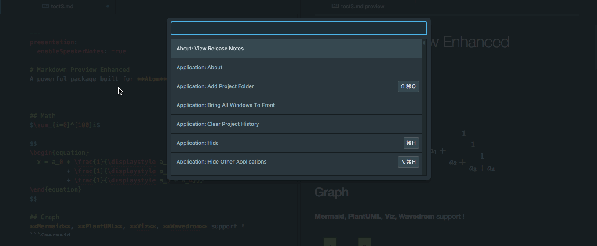
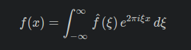
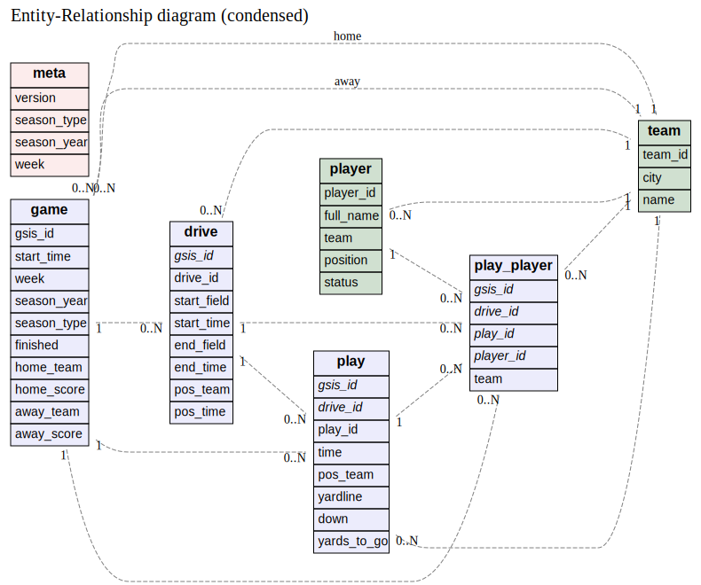
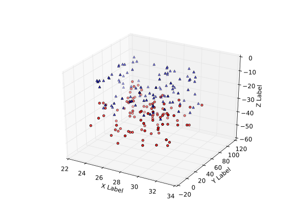

# Getting started with [markdown-preview-enhanced], a package for [Atom] editor


<!-- toc orderedList:0 depthFrom:1 depthTo:6 -->

* [Getting started with [markdown-preview-enhanced], a package for [Atom] editor](#getting-started-with-markdown-preview-enhanced-a-package-for-atom-editor)
  * [Examples](#examples)
    * [Live Preview](#live-preview)
    * [Math Equations](#math-equations)
    * [Database Entity Relation Diagram](#database-entity-relation-diagram)
    * [Python Generated Graph (embedded in document)](#python-generated-graph-embedded-in-document)
  * [Installation](#installation)
  * [Recomended Additional Installation](#recomended-additional-installation)
  * [External Program Support (used in Code Chunks)](#external-program-support-used-in-code-chunks)

<!-- tocstop -->


## Examples
All with live preview and embedded as ***plain text*** in your markdown document. The images below are to demonstrate what is possible

### Live Preview


### Math Equations


### Database Entity Relation Diagram


### Python Generated Graph (embedded in document)


## Installation  
Atom Settings `Ctrl-,`  
Atom Package Manager `Ctrl-Shift-P`
* search `markdown-preview-enhanced` in package manager and install it.  
* disable any previous `markdown-preview` or similar
* restart **atom**


## Recomended Additional Installation  
* search `language-gfm-enhanced` in package manager and install it.  
* disable `language-gfm`
* restart **atom**


## External Program Support (used in Code Chunks)  

**Note: Linux Ubunut specific**

`sudo apt-get install graphviz`
which installs /usr/bin/dot

`sudo apt-get install graphviz-doc`
not necessary to run, but helpful for later consulting man pages

`sudo apt-get install gnuplot`

`sudo apt-get install python-matplotlib`

```
sudo apt-get install haskell-platform
sudo cabal update
sudo cabal install erd
# erd-0.1.3.0 requires base=4.7.*
sudo cabal install --allow-newer erd
```
```
sudo cp ~/.cabal/bin/erd /usr/local/bin/
```
where ~/ was /home/mjackson
if you dont perform the `sudo cp ~/.cabal/bin/erd /usr/local/bin/`
you will have to include `{erd cmd:"/home/mjackson/.cabal/bin/erd",` instead of just `{erd }`


[Atom]: http://atom.io

[markdown-preview-enhanced]: https://github.com/shd101wyy/markdown-preview-enhanced.git
